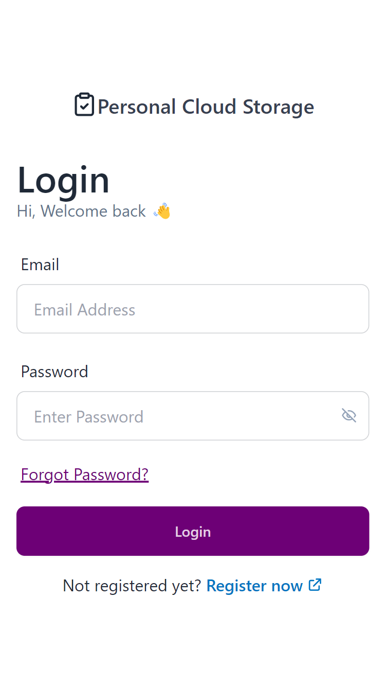
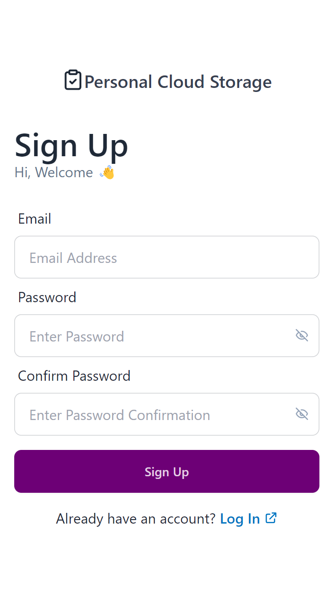
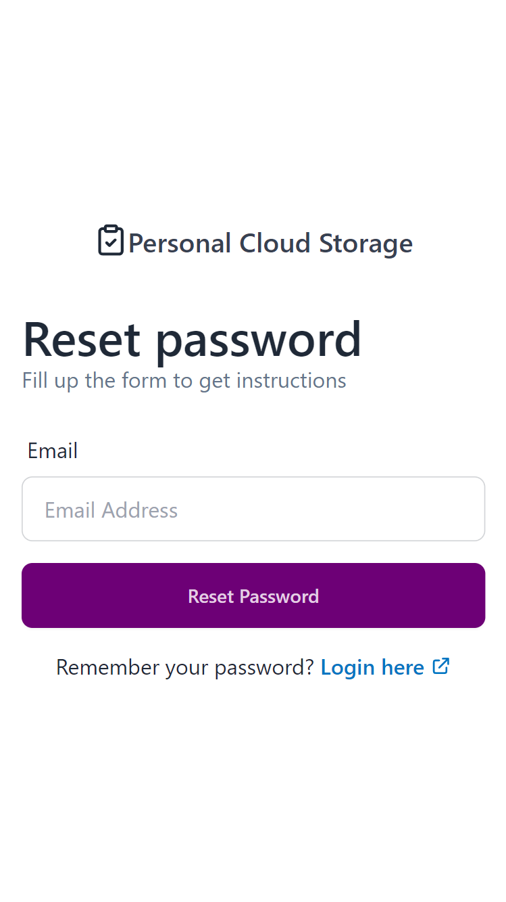
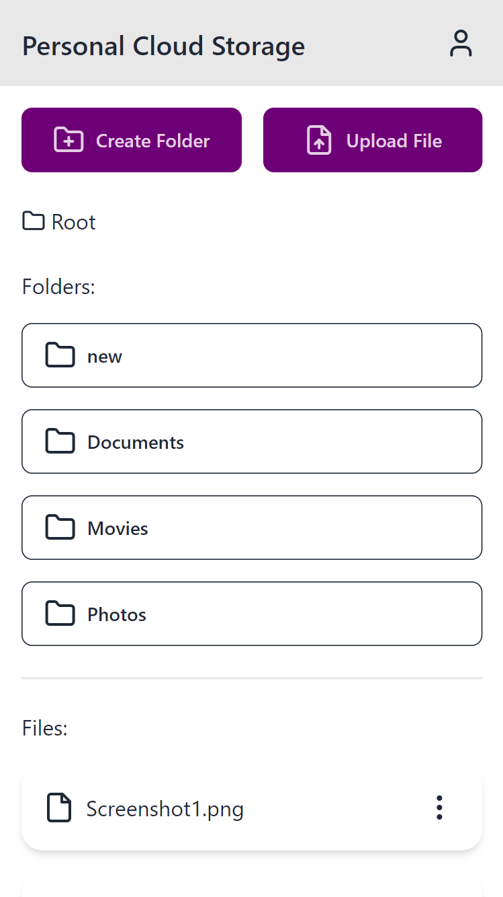
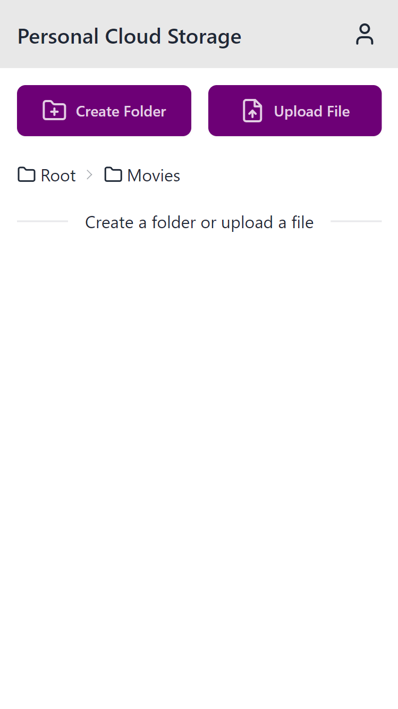
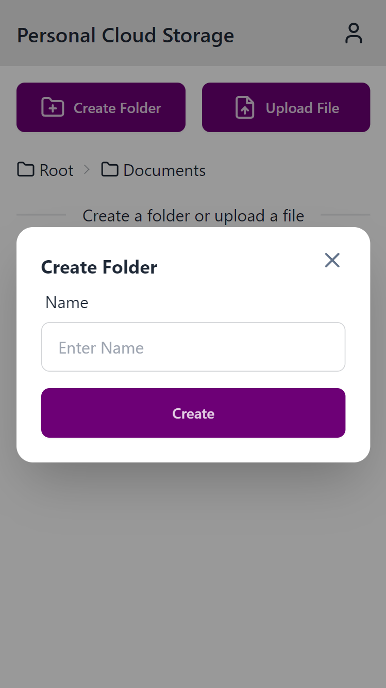

# ☁️ Personal Cloud Storage

A secure and user-friendly **cloud storage web application** that allows users to register, log in, and upload, view, and manage their personal files online.

This project was developed as part of the **Cloud Computing Lab (CCL)** coursework.

---

## 🚀 Features

- 🔐 User Authentication (Login/Signup)
- ☁️ Upload and Store Files in Cloud
- 📁 View & Download Stored Files
- 🗑️ Delete Files
- 📱 Responsive UI for all devices

---

## 🛠️ Tech Stack

- **Frontend**: React.js, Tailwind CSS, DaisyUI  
- **Backend/Services**:  
  - Firebase Authentication  
  - Firebase Firestore  
  - Firebase Cloud Storage

---

## 🖼️ Screenshots

| Login Page | SignUp Page | Reset Password |
|------------|-----------|---------------|
|  |  |  |

| File List | Mobile View | Create File |
|-----------|-------------|---------------------|
|  |  |  |

---

## 📦 Installation & Setup

```bash
# 1. Clone the repository:
git clone https://github.com/Psh09/Personal-Cloud-Storage.git

# 2. Navigate to the project folder:
cd Personal-Cloud-Storage

# 3. Install dependencies:
npm install

# 4. Run the development server:
npm run dev

```
---

## 👨‍💻 Developed By

**Prajwal Halle**  
3rd Year Computer Engineering  
Pillai HOC College of Engineering and Technology  
Email: *prajwalsh22hcompe@student.mes.ac.in*

---

## 📚 License

This project is intended for academic purposes only.
